# 随机过程 (7401) 知识点总复习手册

---

## 第一部分：知识地图

### 1.1 课程知识体系树状图

```mermaid
graph TD
    A[随机过程] --> B[基础概念]
    A --> C[平稳过程]
    A --> D[特殊随机过程]
    A --> E[线性系统分析]
    A --> F[估计与预测]

    B --> B1[随机变量回顾]
    B --> B2[随机过程定义]
    B --> B3[统计描述]
    B3 --> B31[均值函数]
    B3 --> B32[自相关函数]
    B3 --> B33[自协方差函数]
    B3 --> B34[互相关函数]

    C --> C1[广义平稳WSS]
    C --> C2[严格平稳SSS]
    C --> C3[遍历性]
    C3 --> C31[均值遍历]
    C3 --> C32[相关遍历]
    C --> C4[功率谱密度]
    C4 --> C41[维纳-辛钦定理]
    C4 --> C42[白噪声]

    D --> D1[泊松过程]
    D1 --> D11[定义与性质]
    D1 --> D12[增量特性]
    D1 --> D13[散粒噪声]
    D --> D2[马尔可夫链]
    D2 --> D21[离散时间MC]
    D2 --> D22[连续时间MC]
    D2 --> D23[稳态分布]
    D --> D3[维纳过程]
    D --> D4[高斯过程]

    E --> E1[LTI系统响应]
    E1 --> E11[时域分析]
    E1 --> E12[频域分析]
    E --> E2[AR过程]
    E --> E3[MA过程]
    E --> E4[ARMA过程]
    E --> E5[功率谱因式分解]
    E --> E6[白化滤波器]

    F --> F1[线性估计]
    F1 --> F11[正规方程]
    F1 --> F12[MMSE]
    F --> F2[线性预测]
    F2 --> F21[一步预测]
    F2 --> F22[多步预测]
    F --> F3[维纳滤波]
```



### 1.2 考试重点热力图

| 知识点 | 考试频率 | 难度等级 | 预计复习时长 | 分值占比 |
|--------|----------|----------|--------------|----------|
| **WSS过程基本性质** | ★★★ | ⭐⭐ | 2小时 | 15% |
| **自相关函数计算** | ★★★ | ⭐⭐ | 3小时 | 20% |
| **功率谱密度** | ★★★ | ⭐⭐⭐ | 4小时 | 18% |
| **LTI系统分析** | ★★★ | ⭐⭐⭐ | 3小时 | 15% |
| **马尔可夫链** | ★★★ | ⭐⭐ | 3小时 | 15% |
| **泊松过程** | ★★ | ⭐⭐ | 2小时 | 8% |
| **遍历性判定** | ★★ | ⭐⭐⭐ | 2小时 | 5% |
| **线性估计/预测** | ★★ | ⭐⭐⭐⭐ | 4小时 | 10% |
| **AR/MA/ARMA** | ★★ | ⭐⭐⭐ | 3小时 | 8% |
| **非平稳过程** | ★ | ⭐⭐ | 1小时 | 5% |
| **连续时间MC** | ★ | ⭐⭐⭐ | 2小时 | 3% |
| **复随机过程** | ★ | ⭐⭐⭐ | 1小时 | 3% |

**图例说明**：
- ★★★ 高频：几乎每年必考
- ★★ 中频：隔年出现
- ★ 低频：偶尔出现

---

## 第二部分：核心知识点详解

---

### 知识点1：广义平稳过程 (WSS)

#### 理论基础

**定义**：随机过程 $x(t)$ 称为广义平稳（Wide-Sense Stationary, WSS），如果满足：

1. 均值为常数：$E\{x(t)\} = \mu_x = \text{const}$
2. 自相关函数只依赖于时间差：$R_{xx}(t_1, t_2) = R_{xx}(t_1 - t_2) = R_{xx}(\tau)$

**核心公式**：

自相关函数定义：
$$R_{xx}(\tau) = E\{x(t+\tau)x^*(t)\}$$

自协方差函数：
$$C_{xx}(\tau) = R_{xx}(\tau) - |\mu_x|^2$$

**物理意义**：WSS过程的统计特性不随时间平移而改变，即"统计意义上的时不变"。这意味着在任何时间窗口观察该过程，其一阶和二阶统计特性都相同。

#### 推导过程

**WSS自相关函数的性质推导**：

**性质1：对称性** $R_{xx}(-\tau) = R_{xx}^*(\tau)$

证明：
$$R_{xx}(-\tau) = E\{x(t-\tau)x^*(t)\}$$

令 $s = t - \tau$：
$$= E\{x(s)x^*(s+\tau)\} = E\{x^*(s+\tau)x(s)\}^* = R_{xx}^*(\tau)$$

对于实过程：$R_{xx}(-\tau) = R_{xx}(\tau)$（偶函数）

**性质2：最大值在原点** $|R_{xx}(\tau)| \leq R_{xx}(0)$

证明（Cauchy-Schwarz不等式）：
$$|E\{x(t+\tau)x^*(t)\}|^2 \leq E\{|x(t+\tau)|^2\} \cdot E\{|x(t)|^2\}$$

$$|R_{xx}(\tau)|^2 \leq R_{xx}(0) \cdot R_{xx}(0)$$

$$|R_{xx}(\tau)| \leq R_{xx}(0)$$

**性质3：正定性**
对于任意 $n$ 个时刻和任意复数 $a_1, ..., a_n$：
$$\sum_{i=1}^n \sum_{j=1}^n a_i a_j^* R_{xx}(t_i - t_j) \geq 0$$

#### 应用场景

**场景1：信号处理中的噪声建模**
热噪声、散粒噪声等在稳态条件下可建模为WSS过程，便于使用功率谱分析。

**场景2：通信系统分析**
调制信号通过信道后，若信道特性稳定，接收信号可近似为WSS，便于设计最优接收机。

**场景3：控制系统**
稳态工作点附近的扰动可建模为WSS过程，用于卡尔曼滤波器设计。

#### 历年真题再现

- **模拟卷A 第3题(b)**：信号处理系统，验证 $p(t)$ 和 $q(t)$ 的WSS性质
- **模拟卷B 第3题(a)**：温度传感器融合，判断线性组合是否为WSS
- **模拟卷C 第3题(a)**：随机开关系统，判断输出是否为WSS
- **模拟卷D 第3题(a)**：复包络信号，求WSS条件

#### 常见陷阱

**陷阱1：混淆WSS与SSS**
WSS只要求一阶和二阶矩满足条件，而SSS要求所有有限维分布相同。高斯过程中两者等价，但一般情况下SSS⊂WSS。

**陷阱2：忘记检验均值条件**
许多同学只检查自相关是否只依赖于 $\tau$，忘记检验均值是否为常数。

**陷阱3：复过程的共轭**
对于复过程，$R_{xx}(\tau) = E\{x(t+\tau)x^*(t)\}$，注意共轭的位置。

**陷阱4：互相关不对称**
$R_{xy}(\tau) \neq R_{yx}(\tau)$，而是 $R_{xy}(\tau) = R_{yx}^*(-\tau)$

#### 记忆技巧

**口诀**："均值常数，相关只差"
- 均值是常数
- 相关函数只依赖于时间差

**联想记忆**：WSS = "Willing to Stay Stable"（愿意保持稳定）
- 统计特性不随时间漂移

---

### 知识点2：自相关函数与互相关函数

#### 理论基础

**定义**：

自相关函数（实WSS过程）：
$$R_{xx}(\tau) = E\{x(t+\tau)x(t)\}$$

互相关函数（联合WSS）：
$$R_{xy}(\tau) = E\{x(t+\tau)y(t)\}$$

**核心性质**：

| 性质 | 自相关 $R_{xx}(\tau)$ | 互相关 $R_{xy}(\tau)$ |
|------|------------------------|------------------------|
| 对称性 | $R_{xx}(-\tau) = R_{xx}(\tau)$ | $R_{xy}(-\tau) = R_{yx}(\tau)$ |
| 最大值 | $R_{xx}(0) \geq \|R_{xx}(\tau)\|$ | 无此性质 |
| 原点值 | $R_{xx}(0) = E\{x^2(t)\} \geq 0$ | 可正可负 |

**物理意义**：
- $R_{xx}(\tau)$ 描述过程在不同时刻的相似程度
- $R_{xx}(0)$ 是过程的平均功率
- $R_{xy}(\tau)$ 描述两个过程之间的统计相关性

#### 推导过程

**线性组合的自相关推导**：

设 $z(t) = ax(t) + by(t)$，其中 $x(t)$, $y(t)$ 联合WSS。

$$R_{zz}(\tau) = E\{z(t+\tau)z(t)\}$$

$$= E\{[ax(t+\tau)+by(t+\tau)][ax(t)+by(t)]\}$$

展开：
$$= a^2 E\{x(t+\tau)x(t)\} + ab E\{x(t+\tau)y(t)\}$$
$$+ ab E\{y(t+\tau)x(t)\} + b^2 E\{y(t+\tau)y(t)\}$$

$$= a^2 R_{xx}(\tau) + ab R_{xy}(\tau) + ab R_{yx}(\tau) + b^2 R_{yy}(\tau)$$

对于实过程，$R_{yx}(\tau) = R_{xy}(-\tau)$：
$$\boxed{R_{zz}(\tau) = a^2 R_{xx}(\tau) + ab[R_{xy}(\tau) + R_{xy}(-\tau)] + b^2 R_{yy}(\tau)}$$

#### 应用场景

**场景1：传感器数据融合**
多个传感器测量同一物理量时，需要计算融合信号的自相关以评估噪声特性。

**场景2：相关检测**
在噪声中检测已知信号时，计算接收信号与本地副本的互相关来确定信号是否存在。

**场景3：时延估计**
通过互相关函数峰值位置估计两个信号之间的时延。

#### 历年真题再现

- **模拟卷A 第3题(b)(iii)**：求 $R_{pq}(0)$
- **模拟卷B 第3题(a)(i)**：计算传感器融合的 $R_{zz}(\tau)$
- **模拟卷D 第3题(b)**：差分系统的自相关计算

#### 常见陷阱

**陷阱1：符号顺序错误**
$R_{xy}(\tau) = E\{x(t+\tau)y(t)\}$，注意是 $x$ 在前（超前 $\tau$），$y$ 在后。

**陷阱2：忘记 $R_{yx}(\tau) = R_{xy}(-\tau)$**
在计算线性组合时，需要正确处理这个关系。

**陷阱3：离散与连续混淆**
离散：$R_{xx}[m] = E\{x[n+m]x[n]\}$
连续：$R_{xx}(\tau) = E\{x(t+\tau)x(t)\}$

#### 记忆技巧

**口诀**："前超后定，自对称"
- 前面的变量超前（$+\tau$）
- 自相关是偶函数（对称）

---

### 知识点3：功率谱密度 (PSD)

#### 理论基础

**定义**：WSS过程 $x(t)$ 的功率谱密度是自相关函数的傅里叶变换：

连续时间：
$$S_{xx}(\omega) = \int_{-\infty}^{\infty} R_{xx}(\tau) e^{-j\omega\tau} d\tau$$

离散时间：
$$S_{xx}(\omega) = \sum_{m=-\infty}^{\infty} R_{xx}[m] e^{-j\omega m}$$

**维纳-辛钦定理**：
$$R_{xx}(\tau) = \frac{1}{2\pi} \int_{-\infty}^{\infty} S_{xx}(\omega) e^{j\omega\tau} d\omega$$

**核心性质**：
1. 实性：$S_{xx}(\omega)$ 是实函数
2. 非负性：$S_{xx}(\omega) \geq 0$
3. 偶函数：$S_{xx}(-\omega) = S_{xx}(\omega)$
4. 平均功率：$P_x = R_{xx}(0) = \frac{1}{2\pi}\int_{-\infty}^{\infty} S_{xx}(\omega) d\omega$

**物理意义**：$S_{xx}(\omega)$ 表示单位频率带宽内的平均功率，描述功率在频域的分布。

#### 推导过程

**LTI系统输出功率谱推导**：

设WSS输入 $x(t)$ 通过LTI系统（冲激响应 $h(t)$，频率响应 $H(\omega)$），输出 $y(t)$。

输出自相关：
$$R_{yy}(\tau) = E\{y(t+\tau)y(t)\}$$

$$y(t) = \int_{-\infty}^{\infty} h(\alpha)x(t-\alpha)d\alpha$$

经过推导（利用卷积定理）：
$$R_{yy}(\tau) = h(\tau) * h(-\tau) * R_{xx}(\tau)$$

取傅里叶变换：
$$S_{yy}(\omega) = H(\omega) \cdot H^*(\omega) \cdot S_{xx}(\omega)$$

$$\boxed{S_{yy}(\omega) = |H(\omega)|^2 S_{xx}(\omega)}$$

**互功率谱**：
$$S_{xy}(\omega) = H(\omega) S_{xx}(\omega)$$

#### 应用场景

**场景1：滤波器设计**
根据所需的输出功率谱设计滤波器的频率响应。

**场景2：信号检测**
通过功率谱分析识别信号中的周期成分。

**场景3：系统辨识**
利用输入输出功率谱估计系统传递函数。

#### 历年真题再现

- **模拟卷A 第3题(b)**：证明 $S_{pp}(\omega)$ 和 $S_{qq}(\omega)$
- **模拟卷B 第3题(c)**：AR(1)过程的功率谱
- **模拟卷C 第4题(a)**：ARMA(1,1)的功率谱
- **模拟卷D 第3题(b)(iv)**：差分系统的功率谱
- **模拟卷E 第3题(b)**：移动平均滤波器的功率谱

#### 常见陷阱

**陷阱1：忘记取模平方**
$S_{yy}(\omega) = |H(\omega)|^2 S_{xx}(\omega)$，不是 $H^2(\omega)$。

**陷阱2：连续与离散的归一化**
连续：$R_{xx}(0) = \frac{1}{2\pi}\int_{-\infty}^{\infty} S_{xx}(\omega) d\omega$
离散：$R_{xx}[0] = \frac{1}{2\pi}\int_{-\pi}^{\pi} S_{xx}(\omega) d\omega$

**陷阱3：z域与频域混淆**
$S_{xx}(z)$ 是双边z变换，$S_{xx}(\omega) = S_{xx}(e^{j\omega})$

#### 记忆技巧

**口诀**："相关傅里叶，功率模平方"
- 功率谱 = 自相关的傅里叶变换
- 系统响应：输出功率谱 = |H|²×输入功率谱

---

### 知识点4：泊松过程

#### 理论基础

**定义**：计数过程 $N(t)$ 是参数为 $\lambda$ 的泊松过程，如果满足：

1. $N(0) = 0$
2. 独立增量
3. 齐次性：$P\{N(t+s) - N(s) = k\} = \frac{(\lambda t)^k e^{-\lambda t}}{k!}$

**核心公式**：

$$P\{N(t) = k\} = \frac{(\lambda t)^k e^{-\lambda t}}{k!}$$

$$E\{N(t)\} = \lambda t$$

$$\text{Var}(N(t)) = \lambda t$$

$$R_{NN}(t_1, t_2) = \lambda^2 t_1 t_2 + \lambda \min(t_1, t_2)$$

**物理意义**：泊松过程描述随机事件在时间上的均匀分布，如电话呼叫到达、放射性衰变等。$\lambda$ 是单位时间内的平均到达率。

#### 推导过程

**泊松过程自相关函数推导**：

设 $t_1 \leq t_2$，则：
$$R_{NN}(t_1, t_2) = E\{N(t_1)N(t_2)\}$$

利用 $N(t_2) = N(t_1) + [N(t_2) - N(t_1)]$：
$$= E\{N(t_1)[N(t_1) + N(t_2) - N(t_1)]\}$$

$$= E\{N^2(t_1)\} + E\{N(t_1)\} \cdot E\{N(t_2) - N(t_1)\}$$

（利用独立增量性质）

对于泊松分布：$E\{N^2\} = \text{Var}(N) + (E\{N\})^2 = \lambda t + (\lambda t)^2$

$$= \lambda t_1 + \lambda^2 t_1^2 + \lambda t_1 \cdot \lambda(t_2 - t_1)$$

$$= \lambda t_1 + \lambda^2 t_1 t_2$$

$$\boxed{R_{NN}(t_1, t_2) = \lambda \min(t_1, t_2) + \lambda^2 t_1 t_2}$$

#### 应用场景

**场景1：排队论**
顾客到达服务系统建模为泊松过程，用于计算等待时间、队列长度等。

**场景2：可靠性工程**
系统故障发生建模为泊松过程，计算平均故障间隔时间。

**场景3：散粒噪声**
电子器件中的散粒噪声，利用Campbell定理计算均值和方差。

#### 历年真题再现

- **模拟卷B 第3题(b)**：外卖订单到达，计算概率和条件概率
- **模拟卷C 第3题(b)**：雷达脉冲检测，Campbell定理应用

#### 常见陷阱

**陷阱1：混淆到达率与期望**
$\lambda$ 是单位时间到达率，时间 $t$ 内的期望到达数是 $\lambda t$，不是 $\lambda$。

**陷阱2：条件概率忽略独立增量**
$P\{N(t_2) \leq k | N(t_1) = n\} = P\{N(t_2) - N(t_1) \leq k - n\}$

**陷阱3：方差等于均值**
泊松过程的方差等于均值，这与二项分布不同。

#### 记忆技巧

**口诀**："独立齐次泊松来，均方都是λt"
- 独立增量
- 齐次（增量分布只依赖于区间长度）
- 均值 = 方差 = λt

---

### 知识点5：马尔可夫链

#### 理论基础

**定义**：离散时间马尔可夫链是满足马尔可夫性质的随机过程：
$$P\{X_{n+1} = j | X_n = i, X_{n-1}, ..., X_0\} = P\{X_{n+1} = j | X_n = i\}$$

**转移矩阵**：
$$\Pi_{ij} = P\{X_{n+1} = j | X_n = i\}$$

性质：
- $\Pi_{ij} \geq 0$
- $\sum_j \Pi_{ij} = 1$（行和为1）

**稳态分布**：
$$\pi \Pi = \pi, \quad \sum_i \pi_i = 1$$

**物理意义**：马尔可夫性表示"无记忆性"——未来状态只取决于当前状态，与历史无关。

#### 推导过程

**稳态分布的求解**：

对于三状态马尔可夫链，设稳态分布 $\pi = [\pi_1, \pi_2, \pi_3]$。

稳态方程 $\pi \Pi = \pi$ 展开：
$$\pi_1 = \pi_1 \Pi_{11} + \pi_2 \Pi_{21} + \pi_3 \Pi_{31}$$
$$\pi_2 = \pi_1 \Pi_{12} + \pi_2 \Pi_{22} + \pi_3 \Pi_{32}$$
$$\pi_3 = \pi_1 \Pi_{13} + \pi_2 \Pi_{23} + \pi_3 \Pi_{33}$$

加上归一化条件：
$$\pi_1 + \pi_2 + \pi_3 = 1$$

由于前三个方程线性相关（因为各列和为1），用归一化条件替换其中一个方程，解线性方程组。

**n步转移概率**：
$$\Pi^{(n)} = \Pi^n$$

#### 应用场景

**场景1：天气预报**
每日天气状态（晴、阴、雨）建模为马尔可夫链。

**场景2：网页排名**
Google PageRank算法基于网页浏览的马尔可夫链模型。

**场景3：语音识别**
隐马尔可夫模型（HMM）用于语音信号建模。

#### 历年真题再现

- **模拟卷A 第4题(b)**：咖啡店选择，求稳态分布
- **模拟卷B 第4题(b)**：电梯调度，计算多步转移概率
- **模拟卷C 第4题(b)**：天气预报
- **模拟卷D 第4题(a)**：连续时间马尔可夫链（服务器状态）
- **模拟卷E 第4题(b)**：网络路由（含参数）

#### 常见陷阱

**陷阱1：转移矩阵的方向**
行表示当前状态，列表示下一状态。$\Pi_{ij}$ = 从状态 $i$ 到状态 $j$ 的概率。

**陷阱2：方程组线性相关**
$\pi \Pi = \pi$ 给出的方程是线性相关的，必须用归一化条件 $\sum \pi_i = 1$ 替换其中一个。

**陷阱3：多步转移矩阵**
$n$ 步转移矩阵是 $\Pi^n$，不是 $n\Pi$。

**陷阱4：左乘与右乘**
稳态方程是 $\pi \Pi = \pi$（行向量左乘），不是 $\Pi \pi = \pi$。

#### 记忆技巧

**口诀**："行走列到，稳态左乘"
- 行是出发状态，列是到达状态
- 稳态分布是行向量，左乘转移矩阵

---

### 知识点6：LTI系统与随机过程

#### 理论基础

**时域关系**：
$$y(t) = h(t) * x(t) = \int_{-\infty}^{\infty} h(\alpha)x(t-\alpha)d\alpha$$

**频域关系**：
$$Y(\omega) = H(\omega)X(\omega)$$

**统计特性**：

输出均值：
$$E\{y(t)\} = E\{x(t)\} \cdot \int_{-\infty}^{\infty} h(\alpha)d\alpha = \mu_x \cdot H(0)$$

输出自相关：
$$R_{yy}(\tau) = h(\tau) * h(-\tau) * R_{xx}(\tau)$$

输出功率谱：
$$S_{yy}(\omega) = |H(\omega)|^2 S_{xx}(\omega)$$

互相关：
$$R_{xy}(\tau) = h(\tau) * R_{xx}(\tau)$$

互功率谱：
$$S_{xy}(\omega) = H(\omega)S_{xx}(\omega)$$

#### 推导过程

**输出自相关函数推导**：

$$R_{yy}(\tau) = E\{y(t+\tau)y(t)\}$$

$$= E\left\{\int_{-\infty}^{\infty} h(\alpha)x(t+\tau-\alpha)d\alpha \cdot \int_{-\infty}^{\infty} h(\beta)x(t-\beta)d\beta\right\}$$

$$= \int_{-\infty}^{\infty}\int_{-\infty}^{\infty} h(\alpha)h(\beta)E\{x(t+\tau-\alpha)x(t-\beta)\}d\alpha d\beta$$

$$= \int_{-\infty}^{\infty}\int_{-\infty}^{\infty} h(\alpha)h(\beta)R_{xx}(\tau-\alpha+\beta)d\alpha d\beta$$

令 $\gamma = \beta - \alpha$：
$$= \int_{-\infty}^{\infty} R_{xx}(\tau+\gamma) \left[\int_{-\infty}^{\infty} h(\alpha)h(\alpha+\gamma)d\alpha\right] d\gamma$$

定义 $r_h(\gamma) = \int h(\alpha)h(\alpha+\gamma)d\alpha$（确定性自相关）：
$$R_{yy}(\tau) = r_h(\tau) * R_{xx}(\tau)$$

由于 $r_h(\tau) = h(\tau) * h(-\tau)$：
$$\boxed{R_{yy}(\tau) = h(\tau) * h(-\tau) * R_{xx}(\tau)}$$

#### 应用场景

**场景1：滤波器频率响应计算**
给定输入输出功率谱，反推系统频率响应。

**场景2：噪声整形**
设计滤波器将白噪声整形为指定功率谱的色噪声。

**场景3：信号检测与估计**
利用匹配滤波器最大化输出信噪比。

#### 历年真题再现

- **模拟卷A 第3题(b)**：信号处理系统分析
- **模拟卷A 第4题(a)**：MA(2)过程
- **模拟卷B 第3题(c)**：AR(1)频域分析
- **模拟卷D 第3题(b)**：差分系统
- **模拟卷E 第3题(b)**：移动平均滤波器

#### 常见陷阱

**陷阱1：卷积顺序**
$h(\tau) * h(-\tau) * R_{xx}(\tau)$，注意有 $h(-\tau)$（时间反转）。

**陷阱2：离散系统的表示**
离散系统用 $H(z)$ 或 $H(e^{j\omega})$，不要混淆。

**陷阱3：因果性与稳定性**
功率谱因式分解时，$H(z)$ 必须因果稳定（极点在单位圆内）。

#### 记忆技巧

**口诀**："功率模平方，相关卷两遍"
- 功率谱：$|H|^2$
- 自相关：$h * h^- * R_{xx}$（卷两次）

---

### 知识点7：AR/MA/ARMA过程

#### 理论基础

**AR(p) 过程**（自回归）：
$$y[n] = \sum_{k=1}^{p} a_k y[n-k] + x[n]$$

系统函数：$H(z) = \frac{1}{1 - \sum_{k=1}^{p} a_k z^{-k}}$

**MA(q) 过程**（移动平均）：
$$y[n] = x[n] + \sum_{k=1}^{q} b_k x[n-k]$$

系统函数：$H(z) = 1 + \sum_{k=1}^{q} b_k z^{-k}$

**ARMA(p,q) 过程**：
$$y[n] = \sum_{k=1}^{p} a_k y[n-k] + x[n] + \sum_{k=1}^{q} b_k x[n-k]$$

系统函数：$H(z) = \frac{1 + \sum_{k=1}^{q} b_k z^{-k}}{1 - \sum_{k=1}^{p} a_k z^{-k}}$

**功率谱**：
$$S_{yy}(z) = \sigma_x^2 H(z)H(z^{-1})$$

#### 推导过程

**AR(1)自相关函数推导**：

设 $y[n] = ay[n-1] + x[n]$，其中 $E\{x[n]x[m]\} = \sigma^2\delta[n-m]$。

$$R_{yy}[m] = E\{y[n+m]y[n]\}$$

**对于 $m = 0$**：
$$R_{yy}[0] = E\{y^2[n]\} = E\{(ay[n-1]+x[n])^2\}$$
$$= a^2 R_{yy}[0] + \sigma^2$$
$$R_{yy}[0] = \frac{\sigma^2}{1-a^2}$$

**对于 $m \geq 1$**：
$$R_{yy}[m] = E\{y[n+m]y[n]\} = E\{(ay[n+m-1]+x[n+m])y[n]\}$$
$$= aR_{yy}[m-1] + 0$$

递归得：$R_{yy}[m] = a^m R_{yy}[0]$

$$\boxed{R_{yy}[m] = \frac{\sigma^2}{1-a^2} a^{|m|}}$$

#### 应用场景

**场景1：时间序列预测**
AR模型用于股票价格、经济指标预测。

**场景2：语音编码**
线性预测编码（LPC）基于AR模型。

**场景3：谱估计**
参数化功率谱估计比周期图法更平滑。

#### 历年真题再现

- **模拟卷A 第4题(a)**：MA(2)过程分析
- **模拟卷B 第3题(c)**：AR(1)频域分析
- **模拟卷C 第4题(a)**：ARMA(1,1)过程
- **模拟卷E 第4题(a)**：功率谱因式分解

#### 常见陷阱

**陷阱1：AR稳定性条件**
AR过程稳定要求所有极点在单位圆内，即 $|a| < 1$。

**陷阱2：MA自相关的截断性**
MA(q)过程的自相关在 $|m| > q$ 时为零。

**陷阱3：功率谱的z域表示**
$S_{yy}(z) = H(z)H(z^{-1})\sigma^2$，注意 $H(z^{-1})$ 不是 $H^*(z)$。

#### 记忆技巧

**口诀**："AR有反馈，MA只前馈；AR指数衰，MA有限长"
- AR：过去的输出反馈
- MA：过去的输入前馈
- AR自相关：指数衰减
- MA自相关：有限支撑

---

### 知识点8：遍历性

#### 理论基础

**均值遍历**：时间平均等于集合平均
$$\lim_{T \to \infty} \frac{1}{2T}\int_{-T}^{T} x(t)dt = E\{x(t)\} \quad \text{(m.s.)}$$

**相关遍历**：
$$\lim_{T \to \infty} \frac{1}{2T}\int_{-T}^{T} x(t+\tau)x(t)dt = R_{xx}(\tau) \quad \text{(m.s.)}$$

**Slutsky定理**（均值遍历充分条件）：
$$\lim_{T \to \infty} \frac{1}{T}\int_0^T C_{xx}(\tau)d\tau = 0$$

**物理意义**：遍历性允许用单次长时间观测来估计统计特性，这是实际信号处理的基础。

#### 推导过程

**均值遍历条件推导**：

定义时间平均：
$$\bar{x}_T = \frac{1}{2T}\int_{-T}^{T} x(t)dt$$

均方收敛到 $\mu_x$：
$$\lim_{T \to \infty} E\{|\bar{x}_T - \mu_x|^2\} = 0$$

计算：
$$E\{|\bar{x}_T - \mu_x|^2\} = \text{Var}(\bar{x}_T)$$

$$= \frac{1}{4T^2}\int_{-T}^{T}\int_{-T}^{T} C_{xx}(t_1-t_2)dt_1 dt_2$$

$$= \frac{1}{T}\int_0^{2T} \left(1-\frac{\tau}{2T}\right)C_{xx}(\tau)d\tau$$

当 $T \to \infty$：
$$\to \frac{1}{T}\int_0^{T} C_{xx}(\tau)d\tau$$

若此极限为0，则均值遍历。

#### 应用场景

**场景1：功率估计**
单次测量信号的时间平均功率代替集合平均。

**场景2：谱估计**
用单次信号的周期图估计功率谱。

**场景3：通信系统**
假设遍历性来设计基于时间平均的检测器。

#### 历年真题再现

- **模拟卷B 第4题(a)**：利用Slutsky定理判断均值遍历和协方差遍历

#### 常见陷阱

**陷阱1：混淆WSS与遍历性**
WSS不等于遍历。WSS是统计特性的时不变性，遍历性是时间平均等于集合平均。

**陷阱2：Slutsky条件是充分条件**
条件满足则遍历，但不满足不一定不遍历。

**陷阱3：协方差遍历的判定**
需要分析四阶矩，比均值遍历复杂。

#### 记忆技巧

**口诀**："时间集合能互换，Slutsky积分趋于零"
- 遍历性：时间平均 = 集合平均
- Slutsky：$\frac{1}{T}\int C_{xx}(\tau)d\tau \to 0$

---

### 知识点9：线性估计与预测

#### 理论基础

**最小均方误差（MMSE）估计**：

给定观测 $y$，估计 $z$ 的最优线性估计器：
$$\hat{z} = \sum_i a_i y_i$$

**正规方程（正交原理）**：
$$E\{(z - \hat{z})y_i\} = 0, \quad \forall i$$

即：
$$E\{zy_i\} = \sum_j a_j E\{y_j y_i\}$$

矩阵形式：
$$\mathbf{R}_{yy} \mathbf{a} = \mathbf{r}_{zy}$$

**最小MSE**：
$$P_{min} = E\{z^2\} - \mathbf{r}_{zy}^T \mathbf{R}_{yy}^{-1} \mathbf{r}_{zy}$$

**物理意义**：正交原理表明，最优估计的误差与所有观测正交，即误差中不包含任何可从观测中提取的信息。

#### 推导过程

**一阶马尔可夫过程的一步预测**：

设 $R_{ss}(\tau) = \sigma^2 e^{-\alpha|\tau|}$，用 $s(t)$ 预测 $s(t+1)$：
$$\hat{s}(t+1) = hs(t)$$

正规方程：
$$E\{s(t+1)s(t)\} = h \cdot E\{s^2(t)\}$$
$$R_{ss}(1) = h \cdot R_{ss}(0)$$

$$h = \frac{R_{ss}(1)}{R_{ss}(0)} = \frac{\sigma^2 e^{-\alpha}}{\sigma^2} = e^{-\alpha}$$

预测误差：
$$P = E\{(s(t+1) - hs(t))^2\}$$
$$= R_{ss}(0) - 2hR_{ss}(1) + h^2 R_{ss}(0)$$
$$= R_{ss}(0) - h^2 R_{ss}(0) = R_{ss}(0)(1 - e^{-2\alpha})$$

#### 应用场景

**场景1：信号滤波**
从噪声中提取信号，如维纳滤波器。

**场景2：时间序列预测**
股票价格预测、天气预报。

**场景3：状态估计**
卡尔曼滤波器中的状态更新。

#### 历年真题再现

- **模拟卷D 第4题(b)**：最优线性估计，积分估计
- **模拟卷E 第5题(a)**：一阶马尔可夫过程预测
- **模拟卷E 第5题(b)**：噪声中的信号估计

#### 常见陷阱

**陷阱1：正规方程方向**
$E\{(z-\hat{z})y_i\} = 0$，误差与观测正交，不是与估计正交。

**陷阱2：马尔可夫性质的利用**
对于一阶马尔可夫过程，给定当前值，未来与过去独立，所以过去的观测不提供额外信息。

**陷阱3：MMSE的计算**
$P_{min} = E\{z^2\} - \mathbf{r}_{zy}^T \mathbf{a}_{opt}$，不是 $E\{z^2\} - E\{\hat{z}^2\}$。

#### 记忆技巧

**口诀**："误差正交观测，马尔可夫无记忆"
- 正规方程：误差⊥观测
- 马尔可夫：只用当前值预测

---

### 知识点10：Campbell定理（散粒噪声）

#### 理论基础

**散粒噪声模型**：
$$s(t) = \sum_{k} h(t - t_k)$$

其中 $\{t_k\}$ 是泊松过程的到达时刻。

**Campbell定理**：

均值：
$$E\{s(t)\} = \lambda \int_{-\infty}^{\infty} h(\tau)d\tau$$

方差：
$$\text{Var}(s(t)) = \lambda \int_{-\infty}^{\infty} h^2(\tau)d\tau$$

**物理意义**：散粒噪声是大量随机到达的脉冲叠加，如光电探测器中的光子到达、电子管中的热离子发射。

#### 推导过程

**均值推导**：

$$E\{s(t)\} = E\left\{\sum_{k} h(t - t_k)\right\}$$

由于泊松过程的均匀性，可以写成：
$$= \lambda \int_{-\infty}^{\infty} h(t-\tau)d\tau = \lambda \int_{-\infty}^{\infty} h(u)du$$

**方差推导**（利用泊松过程的叠加性质）：

$$\text{Var}(s(t)) = E\{s^2(t)\} - (E\{s(t)\})^2$$

对于泊松脉冲叠加：
$$E\{s^2(t)\} = \lambda \int h^2(\tau)d\tau + \left(\lambda \int h(\tau)d\tau\right)^2$$

$$\text{Var}(s(t)) = \lambda \int_{-\infty}^{\infty} h^2(\tau)d\tau$$

#### 应用场景

**场景1：光电检测**
光子到达建模为泊松过程，计算探测器输出的统计特性。

**场景2：雷达信号处理**
随机到达的雷达脉冲叠加。

**场景3：神经信号**
神经元脉冲发放建模。

#### 历年真题再现

- **模拟卷C 第3题(b)**：雷达脉冲检测，利用Campbell定理计算均值和方差

#### 常见陷阱

**陷阱1：混淆均值与方差公式**
均值：$\lambda \int h$
方差：$\lambda \int h^2$

**陷阱2：积分限**
通常 $h(t)$ 有有限支撑，积分限由 $h(t)$ 的非零区间决定。

#### 记忆技巧

**口诀**："均值一次方，方差二次方"
- 均值：$\lambda \int h(\tau)d\tau$
- 方差：$\lambda \int h^2(\tau)d\tau$

---

### 知识点11：连续时间马尔可夫链

#### 理论基础

**速率矩阵（生成矩阵）**：
$$Q = \lim_{\Delta t \to 0} \frac{\Pi(\Delta t) - I}{\Delta t} = \Pi'(0^+)$$

性质：
- 对角元 $Q_{ii} \leq 0$
- 非对角元 $Q_{ij} \geq 0$，$i \neq j$
- 行和为零：$\sum_j Q_{ij} = 0$

**Kolmogorov方程**：
$$\frac{d\Pi(t)}{dt} = \Pi(t)Q = Q\Pi(t)$$

**稳态分布**：
$$\pi Q = 0, \quad \sum_i \pi_i = 1$$

**物理意义**：$Q_{ij}$（$i \neq j$）表示从状态 $i$ 跳转到状态 $j$ 的速率，$-Q_{ii}$ 表示离开状态 $i$ 的总速率。

#### 推导过程

**从转移概率矩阵求速率矩阵**：

设 $\Pi(t) = \begin{pmatrix} p_{11}(t) & p_{12}(t) \\ p_{21}(t) & p_{22}(t) \end{pmatrix}$

$$Q = \lim_{t \to 0^+} \frac{\Pi(t) - I}{t}$$

例如，若 $\Pi(t) = \begin{pmatrix} 0.7+0.3e^{-5t} & 0.3-0.3e^{-5t} \\ 0.7-0.7e^{-5t} & 0.3+0.7e^{-5t} \end{pmatrix}$

$$\frac{d\Pi}{dt} = \begin{pmatrix} -1.5e^{-5t} & 1.5e^{-5t} \\ 3.5e^{-5t} & -3.5e^{-5t} \end{pmatrix}$$

$$Q = \Pi'(0) = \begin{pmatrix} -1.5 & 1.5 \\ 3.5 & -3.5 \end{pmatrix}$$

#### 应用场景

**场景1：排队系统**
M/M/1队列中顾客数量的变化。

**场景2：可靠性分析**
系统在工作/故障状态之间的转换。

**场景3：化学反应动力学**
分子状态的随机跳变。

#### 历年真题再现

- **模拟卷D 第4题(a)**：服务器状态（Active/Idle），求速率矩阵和稳态分布

#### 常见陷阱

**陷阱1：行和为零**
$Q$ 的每行之和必须为零，这是最基本的检验。

**陷阱2：与离散时间MC混淆**
离散：$\pi \Pi = \pi$
连续：$\pi Q = 0$

**陷阱3：对角元符号**
$Q_{ii} \leq 0$（离开速率），$Q_{ij} \geq 0$（$i \neq j$，到达速率）。

#### 记忆技巧

**口诀**："速率行和零，稳态解齐次"
- $Q$ 的行和 = 0
- 稳态方程：$\pi Q = 0$

---

### 知识点12：非平稳过程

#### 理论基础

**定义**：不满足WSS条件的过程，即：
- 均值依赖于时间：$E\{x(t)\} = \mu_x(t)$
- 或自相关依赖于两个时刻：$R_{xx}(t_1, t_2) \neq R_{xx}(t_1 - t_2)$

**常见非平稳过程**：

1. **维纳过程**：$R_{xx}(t_1, t_2) = \sigma^2 \min(t_1, t_2)$
2. **随机相位正弦**：$x(t) = A\cos(\omega_0 t + \Phi)$
3. **随机开关系统**

**物理意义**：非平稳过程的统计特性随时间变化，如暂态过程、启动过程等。

#### 推导过程

**维纳过程（布朗运动）自相关推导**：

设 $x(t)$ 满足：
1. $x(0) = 0$
2. 独立增量
3. $E\{[x(t_2)-x(t_1)]^2\} = \sigma^2(t_2-t_1)$

对于 $t_1 \leq t_2$：
$$R_{xx}(t_1, t_2) = E\{x(t_1)x(t_2)\}$$

利用 $x(t_2) = x(t_1) + [x(t_2)-x(t_1)]$：
$$= E\{x(t_1)[x(t_1) + (x(t_2)-x(t_1))]\}$$
$$= E\{x^2(t_1)\} + E\{x(t_1)\}E\{x(t_2)-x(t_1)\}$$

由独立增量和零均值：
$$= E\{x^2(t_1)\} + 0 = R_{xx}(t_1, t_1)$$

由性质3：$R_{xx}(t_1, t_1) = E\{[x(t_1)-x(0)]^2\} = \sigma^2 t_1$

$$\boxed{R_{xx}(t_1, t_2) = \sigma^2 \min(t_1, t_2)}$$

#### 应用场景

**场景1：金融建模**
股票价格的随机游走模型。

**场景2：物理扩散**
布朗运动、热扩散过程。

**场景3：系统暂态分析**
系统启动或切换时的过渡过程。

#### 历年真题再现

- **模拟卷A 第3题(a)**：股票价格模型（维纳过程）
- **模拟卷C 第3题(a)**：随机开关系统
- **模拟卷E 第3题(a)**：新产品销量模型

#### 常见陷阱

**陷阱1：误判WSS**
自相关看起来只依赖于 $\tau$，但均值依赖于 $t$，仍然是非平稳的。

**陷阱2：维纳过程的 $\min$ 函数**
$R_{xx}(t_1, t_2) = \sigma^2 \min(t_1, t_2)$，不是 $|t_1 - t_2|$。

#### 记忆技巧

**口诀**："均值变或相关双，非平稳就是它"
- 均值随时间变
- 或自相关依赖两个时刻

---

## 第三部分：题型专项突破

---

### 题型1：判断/证明WSS

#### 解题模板

**步骤**：
1. 计算均值 $E\{x(t)\}$，检验是否为常数
2. 计算自相关 $R_{xx}(t_1, t_2)$
3. 检验 $R_{xx}$ 是否只依赖于 $\tau = t_1 - t_2$

#### 配套练习题

**练习1**：判断 $x(t) = A\cos(\omega_0 t) + B\sin(\omega_0 t)$ 是否WSS，其中 $A$, $B$ 独立，零均值，$E\{A^2\} = E\{B^2\} = \sigma^2$。

**解答**：
- $E\{x(t)\} = 0$ ✓
- $R_{xx}(t_1, t_2) = \sigma^2[\cos\omega_0 t_1 \cos\omega_0 t_2 + \sin\omega_0 t_1 \sin\omega_0 t_2] = \sigma^2 \cos\omega_0(t_1-t_2)$
- 只依赖于 $\tau$ ✓
- **结论**：是WSS

**练习2**：判断 $y(t) = x(t)\cos(\omega_0 t)$ 是否WSS，其中 $x(t)$ 是WSS。

**解答**：
- $E\{y(t)\} = E\{x(t)\}\cos(\omega_0 t)$，依赖于 $t$
- **结论**：不是WSS（除非 $E\{x(t)\} = 0$）

**练习3**：设 $z(t) = ax(t) + by(t)$，$x(t)$, $y(t)$ 联合WSS，证明 $z(t)$ 是WSS。

**解答**：
- $E\{z(t)\} = aE\{x(t)\} + bE\{y(t)\} = a\mu_x + b\mu_y$ = 常数 ✓
- $R_{zz}(t_1, t_2) = a^2 R_{xx}(t_1-t_2) + ab[R_{xy}(t_1-t_2)+R_{yx}(t_1-t_2)] + b^2 R_{yy}(t_1-t_2)$
- 只依赖于 $\tau$ ✓

**练习4**：$x(t) = Ye^{-t}$，$Y \sim N(0, 1)$，判断是否WSS。

**解答**：
- $E\{x(t)\} = 0$ ✓
- $R_{xx}(t_1, t_2) = E\{Y^2\}e^{-(t_1+t_2)} = e^{-(t_1+t_2)}$，依赖于 $t_1+t_2$
- **结论**：不是WSS

**练习5**：判断泊松过程 $N(t)$ 是否WSS。

**解答**：
- $E\{N(t)\} = \lambda t$，依赖于 $t$
- **结论**：不是WSS

---

### 题型2：功率谱计算

#### 解题模板

**步骤**：
1. 识别系统类型（LTI滤波器、AR、MA等）
2. 写出系统函数 $H(z)$ 或 $H(\omega)$
3. 计算 $|H|^2$
4. 应用 $S_{yy} = |H|^2 S_{xx}$

#### 配套练习题

**练习1**：$x[n]$ 是白噪声，$R_{xx}[m] = 4\delta[m]$，$y[n] = x[n] - 0.5x[n-1]$，求 $S_{yy}(\omega)$。

**解答**：
- $H(z) = 1 - 0.5z^{-1}$
- $|H(e^{j\omega})|^2 = |1 - 0.5e^{-j\omega}|^2 = 1.25 - \cos\omega$
- $S_{yy}(\omega) = 4(1.25 - \cos\omega)$

**练习2**：AR(1)过程 $y[n] = 0.9y[n-1] + w[n]$，$S_{ww} = 2$，求 $S_{yy}(\omega)$。

**解答**：
- $H(z) = \frac{1}{1-0.9z^{-1}}$
- $|H|^2 = \frac{1}{1.81 - 1.8\cos\omega}$
- $S_{yy}(\omega) = \frac{2}{1.81 - 1.8\cos\omega}$

**练习3**：$y(t) = x(t+a) - x(t-a)$，$x(t)$ WSS，求 $S_{yy}(\omega)$。

**解答**：
- $H(\omega) = e^{j\omega a} - e^{-j\omega a} = 2j\sin(\omega a)$
- $S_{yy}(\omega) = 4\sin^2(\omega a) S_{xx}(\omega)$

**练习4**：移动平均 $z(t) = \frac{1}{T}\int_{t-T}^{t} y(\tau)d\tau$，求 $H(\omega)$。

**解答**：
- $H(\omega) = \frac{\sin(\omega T/2)}{\omega T/2} e^{-j\omega T/2}$
- $|H(\omega)|^2 = \frac{\sin^2(\omega T/2)}{(\omega T/2)^2}$

**练习5**：ARMA(1,1) $y[n] = 0.8y[n-1] + x[n] + 0.3x[n-1]$，$\sigma_x^2 = 1$，求 $S_{yy}(\omega)$。

**解答**：
- $H(z) = \frac{1+0.3z^{-1}}{1-0.8z^{-1}}$
- $|H|^2 = \frac{1.09 + 0.6\cos\omega}{1.64 - 1.6\cos\omega}$
- $S_{yy}(\omega) = \frac{1.09 + 0.6\cos\omega}{1.64 - 1.6\cos\omega}$

---

### 题型3：马尔可夫链稳态分布

#### 解题模板

**步骤**：
1. 写出转移矩阵 $\Pi$
2. 建立方程 $\pi \Pi = \pi$
3. 展开得线性方程组
4. 用归一化条件 $\sum \pi_i = 1$ 替换一个方程
5. 解方程组

#### 配套练习题

**练习1**：$\Pi = \begin{pmatrix} 0.5 & 0.5 \\ 0.3 & 0.7 \end{pmatrix}$，求稳态分布。

**解答**：
- $\pi_1 = 0.5\pi_1 + 0.3\pi_2 \Rightarrow 0.5\pi_1 = 0.3\pi_2$
- $\pi_1 + \pi_2 = 1$
- $\pi_1 = 0.375, \pi_2 = 0.625$

**练习2**：三状态链，求 $\Pi = \begin{pmatrix} 0.2 & 0.5 & 0.3 \\ 0.4 & 0.4 & 0.2 \\ 0.3 & 0.3 & 0.4 \end{pmatrix}$ 的稳态分布。

**解答**：解 $\pi \Pi = \pi$ 加 $\sum \pi_i = 1$，得 $[\pi_1, \pi_2, \pi_3] \approx [0.31, 0.41, 0.28]$

**练习3**：计算两步转移概率 $(\Pi^2)_{12}$。

**解答**：$(\Pi^2)_{12} = \sum_k \Pi_{1k}\Pi_{k2}$

---

### 题型4：线性估计

#### 解题模板

**步骤**：
1. 设估计器形式 $\hat{z} = \sum a_i y_i$
2. 建立正规方程 $E\{zy_i\} = \sum_j a_j E\{y_j y_i\}$
3. 计算所需的相关值
4. 解线性方程组
5. 计算MMSE = $E\{z^2\} - \sum a_i E\{zy_i\}$

#### 配套练习题

**练习1**：用 $y(t)$ 估计 $s(t)$，$y(t) = s(t) + n(t)$，$R_{ss}(0) = 4$，$R_{nn}(0) = 1$，$s \perp n$。

**解答**：
- 估计器：$\hat{s} = ky$
- 正规方程：$E\{sy\} = kE\{y^2\}$
- $4 = k(4+1)$
- $k = 0.8$
- MMSE = $4 - 0.8 \times 4 = 0.8$

**练习2**：一步预测，$R_{ss}(\tau) = 16e^{-|\tau|/2}$。

**解答**：
- $h = R_{ss}(1)/R_{ss}(0) = e^{-0.5}$
- $P = R_{ss}(0)(1 - e^{-1}) = 16(1 - 0.368) = 10.1$

---

### 题型5：证明题写作规范

#### 如何开头

- 明确目标："要证明..."
- 写出定义："由定义..."
- 列出条件："由题意可知..."

#### 如何过渡

- 使用逻辑连接词："因此"、"由...可得"、"代入上式"
- 标注关键步骤："利用Cauchy-Schwarz不等式"

#### 如何结尾

- 明确结论："因此，原命题成立"
- 用方框标出最终结果

#### 配套练习题

**练习1**：证明实WSS过程的自相关函数是偶函数。

**证明**：
由自相关函数定义：
$$R_{xx}(\tau) = E\{x(t+\tau)x(t)\}$$

对于 $R_{xx}(-\tau)$：
$$R_{xx}(-\tau) = E\{x(t-\tau)x(t)\}$$

令 $s = t - \tau$：
$$= E\{x(s)x(s+\tau)\} = E\{x(s+\tau)x(s)\} = R_{xx}(\tau)$$

因此，$R_{xx}(-\tau) = R_{xx}(\tau)$，即 $R_{xx}(\tau)$ 是偶函数。$\square$

**练习2**：证明 $|R_{xx}(\tau)| \leq R_{xx}(0)$。

**练习3**：证明WSS过程通过LTI系统后仍为WSS。

---

## 第四部分：考前速记清单

---

### 必背公式表

| 公式名称 | 公式 | 适用条件 | 常见错误 |
|----------|------|----------|----------|
| WSS自相关对称性 | $R_{xx}(-\tau) = R_{xx}(\tau)$ | 实WSS过程 | 复过程需共轭 |
| 功率谱定义 | $S_{xx}(\omega) = \mathcal{F}\{R_{xx}(\tau)\}$ | WSS | 混淆单双边 |
| LTI输出功率谱 | $S_{yy}(\omega) = \|H(\omega)\|^2 S_{xx}(\omega)$ | LTI系统 | 忘记取模平方 |
| 泊松分布 | $P(N=k) = \frac{(\lambda t)^k e^{-\lambda t}}{k!}$ | 泊松过程 | 参数是$\lambda t$不是$\lambda$ |
| 泊松均值方差 | $E\{N(t)\} = \text{Var}(N(t)) = \lambda t$ | 泊松过程 | 均值≠方差（一般分布） |
| Campbell定理均值 | $E\{s(t)\} = \lambda \int h(\tau)d\tau$ | 散粒噪声 | 与方差公式混淆 |
| Campbell定理方差 | $\text{Var}(s(t)) = \lambda \int h^2(\tau)d\tau$ | 散粒噪声 | 是$h^2$不是$h$ |
| AR(1)自相关 | $R_{yy}[m] = \frac{\sigma^2}{1-a^2} a^{\|m\|}$ | $\|a\|<1$ | 忘记稳定性条件 |
| 稳态方程 | $\pi \Pi = \pi$ | 马尔可夫链 | 方向（左乘） |
| 速率矩阵 | $Q = \Pi'(0^+)$ | 连续MC | 行和为零 |
| 正规方程 | $E\{(z-\hat{z})y_i\} = 0$ | 线性估计 | 误差⊥观测 |
| MMSE | $P = E\{z^2\} - \mathbf{r}_{zy}^T \mathbf{R}_{yy}^{-1} \mathbf{r}_{zy}$ | 最优估计 | 公式复杂易错 |

---

### 必背定理表

| 定理名称 | 内容 | 应用场景 |
|----------|------|----------|
| 维纳-辛钦定理 | $R_{xx}(\tau) \leftrightarrow S_{xx}(\omega)$ | 功率谱分析 |
| Slutsky定理 | $\frac{1}{T}\int_0^T C_{xx}(\tau)d\tau \to 0 \Rightarrow$ 均值遍历 | 遍历性判定 |
| 正交原理 | 最优估计误差与观测正交 | 线性估计 |
| 马尔可夫性 | 给定现在，未来与过去独立 | 预测器设计 |
| Chapman-Kolmogorov | $\Pi(t+s) = \Pi(t)\Pi(s)$ | 多步转移 |

---

### 重要不等式

| 不等式 | 形式 | 用途 |
|--------|------|------|
| Cauchy-Schwarz | $\|E\{XY\}\|^2 \leq E\{X^2\}E\{Y^2\}$ | 证明 $\|R_{xx}(\tau)\| \leq R_{xx}(0)$ |
| 三角不等式 | $\|E\{X+Y\}\| \leq E\{\|X\|\} + E\{\|Y\|\}$ | 期望界估计 |

---

### 常用变换对

| 时域 | 频域/z域 |
|------|----------|
| $\delta(\tau)$ | $1$ |
| $e^{-\alpha\|\tau\|}$ | $\frac{2\alpha}{\alpha^2+\omega^2}$ |
| $a^{\|m\|}$ | $\frac{1-a^2}{(1-ae^{j\omega})(1-ae^{-j\omega})}$ |
| $\text{rect}(\tau/T)$ | $T \cdot \text{sinc}(\omega T/2\pi)$ |

---

## 第五部分：错题本

---

### 易错题1：WSS判定中的均值条件

**题目**：判断 $x(t) = A\cos(\omega_0 t + \Phi)$ 是否WSS，其中 $\Phi \sim U[0, 2\pi]$，$A$ 为常数。

**错误答案**：只检查自相关，发现 $R_{xx}(\tau) = \frac{A^2}{2}\cos(\omega_0\tau)$ 只依赖于 $\tau$，结论"是WSS"。

**错误原因**：忽略了均值条件。

**正确做法**：
- $E\{x(t)\} = AE\{\cos(\omega_0 t + \Phi)\} = A \cdot \frac{1}{2\pi}\int_0^{2\pi} \cos(\omega_0 t + \phi)d\phi = 0$ ✓
- $R_{xx}(\tau) = \frac{A^2}{2}\cos(\omega_0\tau)$ ✓
- **结论**：是WSS

**教训**：WSS有两个条件，都必须检验。

---

### 易错题2：功率谱的模平方

**题目**：$y(t) = x(t+a) + x(t-a)$，求 $S_{yy}(\omega)$。

**错误答案**：$H(\omega) = e^{j\omega a} + e^{-j\omega a} = 2\cos(\omega a)$，$S_{yy}(\omega) = 4\cos^2(\omega a) S_{xx}(\omega)$。

**错误原因**：实际上是正确的！但有同学写成 $2\cos(\omega a) S_{xx}(\omega)$，忘记取模平方。

**正确做法**：
- $|H(\omega)|^2 = |2\cos(\omega a)|^2 = 4\cos^2(\omega a)$
- $S_{yy}(\omega) = 4\cos^2(\omega a) S_{xx}(\omega)$

**教训**：功率谱公式是 $|H|^2$，不是 $H$。

---

### 易错题3：马尔可夫链转移矩阵方向

**题目**：写出转移矩阵，从状态1到状态2概率0.3，从状态2到状态1概率0.7。

**错误答案**：
$$\Pi = \begin{pmatrix} 0.7 & 0.3 \\ 0.7 & 0.3 \end{pmatrix}$$

**错误原因**：把"到"和"从"搞反了。

**正确做法**：
行是当前状态，列是下一状态：
$$\Pi = \begin{pmatrix} 0.7 & 0.3 \\ 0.7 & 0.3 \end{pmatrix}$$
不对！从1到2是0.3，所以 $\Pi_{12} = 0.3$。从2到1是0.7，所以 $\Pi_{21} = 0.7$。
$$\Pi = \begin{pmatrix} ? & 0.3 \\ 0.7 & ? \end{pmatrix}$$
对角元由行和=1确定。

**教训**：$\Pi_{ij}$ = 从 $i$ 到 $j$ 的概率。

---

### 易错题4：泊松过程条件概率

**题目**：$N(t)$ 是泊松过程，$\lambda = 2$。已知 $N(10) = 5$，求 $P\{N(15) = 8\}$。

**错误答案**：直接计算 $P\{N(15) = 8\} = \frac{(30)^8 e^{-30}}{8!}$

**错误原因**：忽略了条件 $N(10) = 5$。

**正确做法**：
利用独立增量：
$$P\{N(15) = 8 | N(10) = 5\} = P\{N(15) - N(10) = 3\}$$
$$= P\{N(5) = 3\} = \frac{(10)^3 e^{-10}}{3!}$$

**教训**：条件概率要利用独立增量性质。

---

### 易错题5：互相关的对称性

**题目**：$R_{xy}(\tau) = 3e^{-|\tau|}$，求 $R_{yx}(\tau)$。

**错误答案**：$R_{yx}(\tau) = R_{xy}(\tau) = 3e^{-|\tau|}$

**错误原因**：互相关不对称。

**正确做法**：
$$R_{yx}(\tau) = R_{xy}(-\tau) = 3e^{-|-\tau|} = 3e^{-|\tau|}$$
在这个特定例子中，由于 $R_{xy}$ 是偶函数，所以 $R_{yx} = R_{xy}$。但一般情况下 $R_{yx}(\tau) = R_{xy}(-\tau)$。

**教训**：先应用公式 $R_{yx}(\tau) = R_{xy}(-\tau)$，再化简。

---

### 易错题6：AR过程稳定性

**题目**：$y[n] = 1.2y[n-1] + x[n]$，求 $R_{yy}[0]$。

**错误答案**：$R_{yy}[0] = \frac{\sigma^2}{1-1.44} = \frac{\sigma^2}{-0.44}$（负数？）

**错误原因**：$|a| = 1.2 > 1$，系统不稳定，公式不适用。

**正确做法**：指出该系统不稳定，无法达到稳态，$R_{yy}[0]$ 会发散到无穷大。

**教训**：使用AR公式前检查稳定性条件 $|a| < 1$。

---

### 易错题7：正规方程的方向

**题目**：用 $y_1, y_2$ 估计 $z$，$\hat{z} = a_1 y_1 + a_2 y_2$，写出正规方程。

**错误答案**：$E\{(z - \hat{z})z\} = 0$

**错误原因**：正交原理是误差与观测正交，不是与被估计量正交。

**正确做法**：
$$E\{(z - \hat{z})y_1\} = 0$$
$$E\{(z - \hat{z})y_2\} = 0$$

**教训**：正规方程是误差⊥观测。

---

### 易错题8：Campbell定理的系数

**题目**：散粒噪声，$\lambda = 3$，$h(t) = e^{-t}u(t)$，求方差。

**错误答案**：$\text{Var} = 3 \int_0^\infty e^{-t}dt = 3$

**错误原因**：方差公式是 $\int h^2$，不是 $\int h$。

**正确做法**：
$$\text{Var} = \lambda \int_0^\infty e^{-2t}dt = 3 \times \frac{1}{2} = 1.5$$

**教训**：均值用 $h$，方差用 $h^2$。

---

### 易错题9：连续MC的稳态方程

**题目**：速率矩阵 $Q = \begin{pmatrix} -2 & 2 \\ 3 & -3 \end{pmatrix}$，求稳态分布。

**错误答案**：用 $\pi Q = \pi$ 求解。

**错误原因**：应该是 $\pi Q = 0$（零向量），不是 $\pi$。

**正确做法**：
$$-2\pi_1 + 3\pi_2 = 0$$
$$\pi_1 + \pi_2 = 1$$
解得 $\pi_1 = 0.6, \pi_2 = 0.4$

**教训**：离散MC是 $\pi\Pi = \pi$，连续MC是 $\pi Q = 0$。

---

### 易错题10：非平稳过程的自相关

**题目**：$x(t) = Y \cdot t$，$Y \sim N(0, 1)$，求 $R_{xx}(t_1, t_2)$。

**错误答案**：$R_{xx}(\tau) = E\{Y^2\} \cdot t(t+\tau)$

**错误原因**：非平稳过程的自相关不能只用 $\tau$ 表示。

**正确做法**：
$$R_{xx}(t_1, t_2) = E\{x(t_1)x(t_2)\} = E\{Y^2\} \cdot t_1 t_2 = t_1 t_2$$

**教训**：非平稳过程保留 $t_1, t_2$ 两个变量。

---

## 附录：快速参考卡

### A. 符号约定

| 符号 | 含义 |
|------|------|
| $x(t)$, $y(t)$ | 连续时间随机过程 |
| $x[n]$, $y[n]$ | 离散时间随机过程 |
| $R_{xx}(\tau)$ | 自相关函数 |
| $C_{xx}(\tau)$ | 自协方差函数 |
| $S_{xx}(\omega)$ | 功率谱密度 |
| $H(\omega)$, $H(z)$ | 系统频率响应/传递函数 |
| $\Pi$ | 转移概率矩阵 |
| $Q$ | 速率矩阵 |
| $\pi$ | 稳态分布（行向量） |

### B. 重要关系式速查

```
均值：     E{y(t)} = μ_x · H(0)
自相关：   R_yy(τ) = h(τ) * h(-τ) * R_xx(τ)
功率谱：   S_yy(ω) = |H(ω)|² S_xx(ω)
互相关：   R_xy(τ) = h(τ) * R_xx(τ)
互功率谱： S_xy(ω) = H(ω) S_xx(ω)
```

### C. 考试时间分配建议

- 选择/填空题：20分钟
- 计算题（每题）：15-20分钟
- 证明题：15分钟
- 检查：10分钟

---

**祝考试顺利！**

*本复习手册基于历年试题整理，覆盖随机过程课程核心知识点。建议结合课本和习题册使用，重点掌握标注为★★★的高频考点。*
